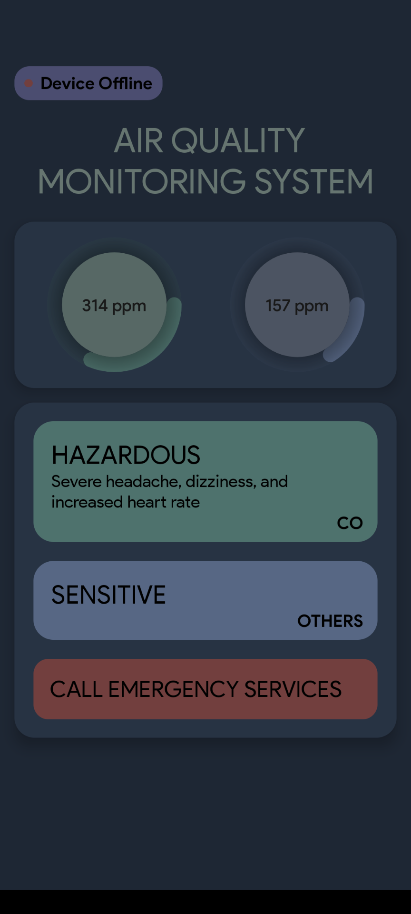
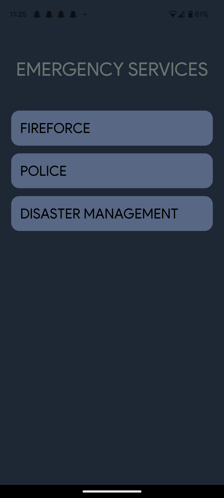

# Abstract

Air pollution is a major problem in many cities around the world, and it can have serious health consequences for people who are exposed to high levels of pollution. To address this problem, we propose an air quality monitoring system that uses IoT sensors (MQ135 & MQ7) to measure the levels of carbon monoxide and other gases in the air. The data from these sensors can be viewed in an app. The app will display the current levels of pollution, as well as historical data in the form of graphs.

# Purpose and Need

Exposure to high levels of carbon monoxide and other gases in the air can have serious health consequences, including headaches, dizziness, nausea, and even death in extreme cases. Long-term exposure to these pollutants can also lead to chronic respiratory problems, cardiovascular disease, and other health issues. By monitoring the levels of these gases in the air, we can take steps to reduce our exposure to these harmful gases and protect our health.

# Project Objective

The objective of the air quality monitoring project is to provide people with accurate and up-to-date information about the levels of carbon monoxide and other gases in the air.  By doing so, the project aims to raise awareness about the problem of air pollution and encourage people to take action to reduce their exposure to harmful pollutants. Ultimately, the project aims to improve public health.

# Hardware Requirements

- MQ135 Gas sensor
- MQ7 CO sensor
- Raspberry Pi Zero W
- Breadboard
- MCP3008

# Software Requirements

- <a href="https://nodejs.org/en/download">Node.js</a>
- <a href="https://firebase.google.com/">Firebase Realtime database</a>
- <a href="https://reactnative.dev/">React Native</a> using <a href="https://docs.expo.dev/get-started/expo-go/">Expo Go</a>
- Operating System - Android 5+ / iOS 13+

# Result

<table>
  <tr>
    <td align="center" width="300px">
      <p>Home Screen</p>
      
    </td>
    <td align="center" width="300px">
      <p>Emergency Contacts</p>
        
    </td>
    <td align="center" width="300px">
      <p>Graphical Analysis</p>
      
    </td>
  </tr>
  <tr>
   <td align="center" width="300px">
      <p>Graphical Analysis - Morning</p>
      
    </td>
    <td align="center" width="300px">
      <p>Graphical Analysis - Evening</p>
      
    </td>
    <td align="center" width="300px">
      <p>Graphical Analysis - Night</p>
      
    </td>
  </tr>
</table>

# Installation

## React Native App

1. Clone this repository and change directory

```bash
git clone https://github.com/abi-2002/airquality-monitoring.git
cd airquality-monitoring
```

2. Install NPM packages using expo

```bash
npx expo install
```

3. Provide the appropriate configurations in `firebase.js`

```javascript
const firebaseConfig = {
  apiKey: "YOUR_API_KEY",
  authDomain: "FIREBASE_PROJECT_DOMAIN",
  databaseURL: "DATABASE_URL",
  projectId: "PROJECT_ID",
  storageBucket: "STORAGE_BUCKET",
  messagingSenderId: "MSG_SENDER_ID",
  appId: "APP_ID",
};
```

4. Run the application

```bash
npx expo start
```

## Raspberry Pi

1. Copy `read_sensors.py` to the Raspberry Pi.
2. Execute the script

```bash
python3 read_sensors.py
```
